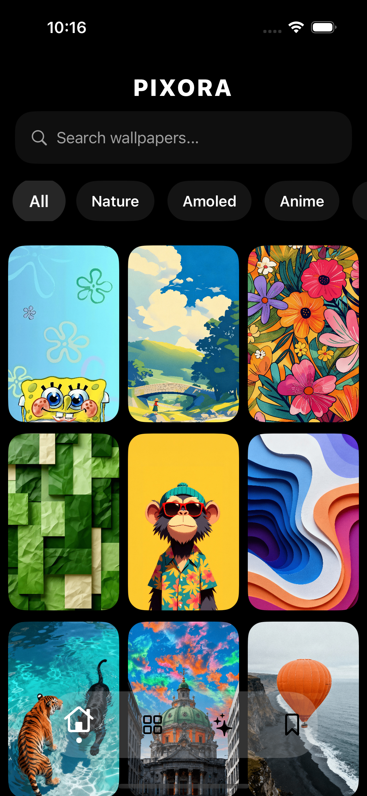

# Pixora

Pixora is a beautifully designed iOS wallpaper app that provides multiple categories, HD wallpapers, downloads, and a smooth browsing experience. Perfect for users who want fresh, high‑quality wallpapers for their home and lock screen.

---

## 🚀 Features

* 🔥 Multiple wallpaper categories
* 📥 Download wallpapers directly to gallery
* ❤️ Favourite wallpapers for quick access
* 🖼️ High‑resolution images
* ⚡ Smooth UI and fast loading
* 📱 Clean, modern iOS‑style design

---

## 📸 Screenshots

Place your screenshots in the `Resources/` folder and update the filenames below.

### 📱 App Screens

<p align="center">
  
</p>

Replace the image names with your actual screenshot filenames.

---

## 🛠️ Tech Stack

* **Swift / SwiftUI**
* **URLSession / AsyncImage** for image loading
* **MVVM Architecture**

---

## 📦 Installation

Clone the project:

```bash
git clone https://github.com/yourusername/Pixora.git
```

Open the project in Xcode and run on iPhone.

---

## 📄 License

This project is open‑source. Feel free to customize it.

---

## 🙌 Credits

Developed by Aryan Rawat.
